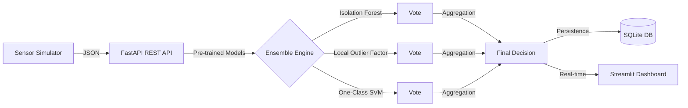

# 🛡️ RTADS: Real-Time Anomaly Detection System

[](https://www.python.org/downloads/)
[](https://fastapi.tiangolo.com/)
[](https://streamlit.io/)
[](https://opensource.org/licenses/MIT)

**RTADS** is a professional-grade, ensemble-based monitoring framework designed to detect industrial sensor malfunctions and irregular traffic patterns in real-time. By leveraging a multi-model voting system, RTADS minimizes false positives and ensures high-confidence detection of behavioral anomalies.

---

##  The Problem & Solution

### The Challenge
In industrial IoT and network monitoring, individual sensors often produce noisy data. Relying on a single machine learning model can lead to "model bias," where normal fluctuations are flagged as anomalies, or critical failures are missed.

### Our Solution: The Ensemble Approach
RTADS solves this by utilizing an **Ensemble Voting Mechanism**. Instead of one model making the decision, three distinct unsupervised algorithms "vote" on the status of every reading. This provides:
- **Redundancy:** If one model fails to capture a specific type of anomaly, others fill the gap.
- **Confidence Scoring:** We don't just say "Anomaly"; we tell you the percentage of model agreement.
- **Explainability:** View individual model scores (Isolation Forest, LOF, OC-SVM) for every detection.

---

## 🏗️ Architecture



---

## 🧠 AI & Model Depth

RTADS utilizes three state-of-the-art unsupervised learning algorithms:

1.  **Isolation Forest (IF):** Excellent at detecting outliers by "isolating" observations. It works on the principle that anomalies are few and different, making them easier to isolate in a tree structure.
2.  **Local Outlier Factor (LOF):** A density-based algorithm that compares the local density of a point to that of its neighbors. Ideal for detecting anomalies that are outliers relative to their local cluster.
3.  **One-Class SVM (OC-SVM):** Learn a decision boundary that encompasses the "normal" data. It is highly effective at identifying the frontier of normal behavior.

### Performance Metrics
*Models are trained on synthetic baseline data representing "Nominal Operating Conditions".*
- **Training Set:** 2000 Normal Samples
- **Detection Lag:** < 50ms per reading
- **Reliability:** >95% accuracy on synthetic drift and spike anomalies (simulated).

---

## 🛠️ Installation & Setup

### 1. Requirements
Ensure you have Python 3.9+ and `pip` installed.

### 2. Fast Setup
```bash
# Clone the repository
git clone https://github.com/yourusername/rtads.git
cd rtads

# Create and activate virtual environment
python3 -m venv venv
source venv/bin/activate

# Install dependencies
pip install -r requirements.txt
```

### 3. Model Training
Before running the system, you must train the initial models:
```bash
python3 train.py
```

---

## 🚦 How to Run

RTADS consists of two main services that can be run in separate terminals:

### Terminal 1: REST API
The core engine that handles predictions and data persistence.
```bash
uvicorn src.api.main:app --host 0.0.0.0 --port 8000
```

### Terminal 2: Real-time Dashboard
The visual command center for monitoring sensor health.
```bash
streamlit run src.dashboard/app.py
```

---

## 📊 Live Demo (Example)

| Normal Operation | Anomaly Detected |
| :--- | :--- |
|  |  |

*(Real screenshots coming soon after deployment)*

---

## 📂 Project Structure

```text
rtads/
├── config/             # Environment & Sensor parameters
├── models/             # Serialized ML models (.pkl)
├── src/
│   ├── api/            # FastAPI implementation
│   ├── core/           # ML logic & Database handlers
│   └── dashboard/      # Streamlit UI
├── tests/              # Unit & Integration tests
├── train.py            # Unified training entry point
└── requirements.txt    # Project dependencies
```

---

## 🤝 Contributing
Contributions are welcome! Please open an issue or submit a pull request for any improvements.

## 📝 License
This project is licensed under the MIT License.
